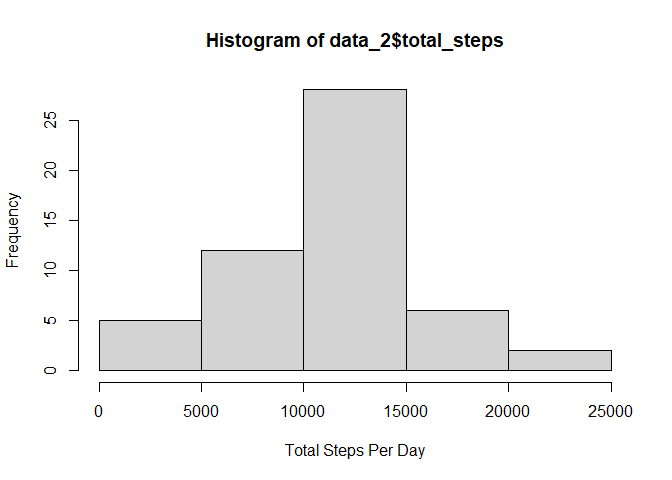
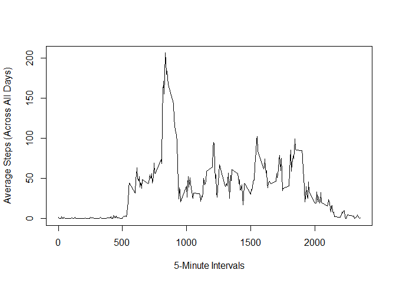
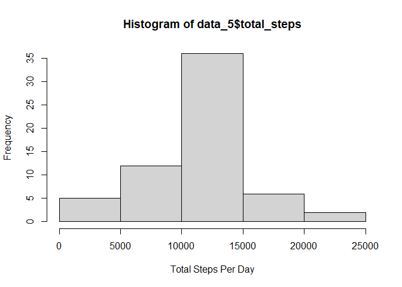
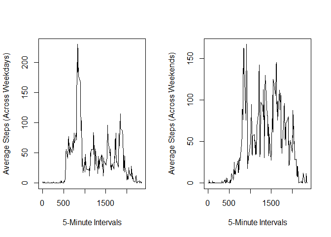

## Loading and preprocessing the data

We begin by creating a folder called "data"" containing our data:

```r
if(!file.exists("data")){
  dir.create("data")
}
```

Then, we unzip the contents of activity.zip into the "data" folder:

```r
unzip("./activity.zip", list = FALSE, exdir = "./data")
```

Now, let's read in our data:

```r
data <- read.csv("./data/activity.csv")
```

Let's explore the data a little bit:

```r
head(data)
```

```
##   steps       date interval
## 1    NA 2012-10-01        0
## 2    NA 2012-10-01        5
## 3    NA 2012-10-01       10
## 4    NA 2012-10-01       15
## 5    NA 2012-10-01       20
## 6    NA 2012-10-01       25
```


```r
tail(data)
```

```
##       steps       date interval
## 17563    NA 2012-11-30     2330
## 17564    NA 2012-11-30     2335
## 17565    NA 2012-11-30     2340
## 17566    NA 2012-11-30     2345
## 17567    NA 2012-11-30     2350
## 17568    NA 2012-11-30     2355
```

We're seeing some NA's in the data.  Let's explore it further:

```r
summary(data)
```

```
##      steps            date              interval     
##  Min.   :  0.00   Length:17568       Min.   :   0.0  
##  1st Qu.:  0.00   Class :character   1st Qu.: 588.8  
##  Median :  0.00   Mode  :character   Median :1177.5  
##  Mean   : 37.38                      Mean   :1177.5  
##  3rd Qu.: 12.00                      3rd Qu.:1766.2  
##  Max.   :806.00                      Max.   :2355.0  
##  NA's   :2304
```


So, we have 2304 NA's in the data.  We can remove these but I choose not to.  I will be removing them later on when the need arises.

## What is mean total number of steps taken per day?

For this part, we will be ignoring the NAs.  So, we can remove them:


```r
data_1 = na.omit(data)
```

Our first task is to calculate the total number of steps taken per day.  We do this as follows:


```r
data_2 <- setNames(aggregate(data_1$steps, list(data_1$date), sum), c("date", "total_steps"))
```

Our next task is to make a histogram of the total number of steps taken each day:


```r
hist(data_2$total_steps, xlab = "Total Steps Per Day")
```

<!-- -->

Our last task is to report the mean and the median of the total number of steps taken each day:


```r
mean(data_2$total_steps)
```

```
## [1] 10766.19
```


```r
median(data_2$total_steps)
```

```
## [1] 10765
```

## What is the average daily activity pattern?

For this part, we are tasked to make a time series plot for the 5-minute interval (x-axis) and the average number of steps taken, averaged across all days.  We do this as follows:


```r
data_3 <- setNames(aggregate(data_1$steps, list(data_1$interval), mean), c("interval", "average_steps"))

with(data_3, plot(interval, average_steps, xlab = "5-Minute Intervals", ylab = "Average Steps (Across All Days)", type = 'l'))
```

<!-- -->

Then, we find the maximum interval for which the average is a maximum:


```r
which.max(data_3$average_steps)
```

```
## [1] 104
```

```r
data$interval[104]
```

```
## [1] 835
```

## Imputing missing values

We calculate the number of NAs in our original data.


```r
sum(is.na(data))
```

```
## [1] 2304
```

Our strategy for imputation is to use the average steps (across all days) for each interval.  We implement this as follows:


```r
imputes <- rep(data_3$average_steps, 61) 

nonnas <- data
nonnas$steps[is.na(nonnas$steps)] <- 0

data_4 <- data
data_4$steps <- is.na(data$steps) * imputes + nonnas$steps
```

Now, we make a histogram for the total number of steps taken per day and repor the mean and the median again:


```r
data_5 <- setNames(aggregate(data_4$steps, list(data_4$date), sum), c("date", "total_steps"))
```


```r
hist(data_5$total_steps, xlab = "Total Steps Per Day")
```

<!-- -->


```r
mean(data_5$total_steps)
```

```
## [1] 10766.19
```


```r
median(data_5$total_steps)
```

```
## [1] 10766.19
```

We get the same mean which is expected because we imputed using the mean.  However, we get a slightly different median from the previous calculation.  In fact, the median now is equal to the mean.

## Are there differences in activity patterns between weekdays and weekends?

Here, we first create a factor variable with two levels: "weekday" and "weekend":


```r
weekend <- c("Saturday", "Sunday")
data_6 <- data_4
data_6$week_factor <-factor(weekdays(as.POSIXlt(data_6$date)) %in% weekend, levels=c(FALSE, TRUE), labels=c('weekday', 'weekend'))  
```

Now, let's do a panel plot:


```r
data_7 <- setNames(aggregate(data_6$steps, list(data_6$interval, data_6$week_factor), mean), c("interval", "week_factor", "average_steps"))

par(mfrow = c(1, 2))

plot(data_7$interval[data_7$week_factor == 'weekday'], data_7$average_steps[data_7$week_factor == 'weekday'], xlab = "5-Minute Intervals", ylab = "Average Steps (Across Weekdays)", type ='l')

plot(data_7$interval[data_7$week_factor == 'weekend'], data_7$average_steps[data_7$week_factor == 'weekend'], xlab = "5-Minute Intervals", ylab = "Average Steps (Across Weekends)", type = 'l')
```

<!-- -->
